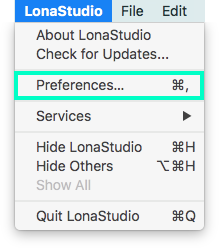
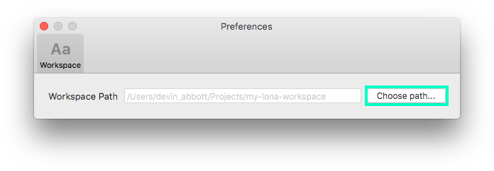

<p align="center">
  
</p>

<h1 align="center">Lona (Developer Preview)</h1>

<br />

> This is a *highly experimental* prototype. We've made it public to begin a conversation with other people who are interested in design at scale. While this tool handles the Airbnb design system fairly well (at a rudimentary level), there are many gaps. We hope to collaborate with others to identify and fill these gaps.
>
> We don't provide any support of any kind. You shouldn't use this for production unless you _really know what you're doing_. The API and file format will change without warning as we continue development. As this is largely still a research project, there are no automated tests and the code is not yet at the same degree of technical rigor as other Airbnb projects.

## Overview

Lona is a collection of tools for building design systems and using them to generate cross-platform UI code, Sketch files, images, and other artifacts.

A design system is defined in JSON as a collection of:
- Components (can be nested)
- Colors, Text Styles, Gradients, and Shadows
- Data Types

The specification for these files can be found in the [docs](./docs/file-formats/README.md).

### Lona Studio

Lona Studio provides a graphical interface for working with these JSON files.

Lona Studio is useful for:
- Building component systems
- Quickly mocking up new screens from existing components
- Viewing designs with real data from JSON files or APIs
- Experimenting with designs across multiple screen sizes
- Automating design tasks - e.g. localizing screenshots for different languages and exporting hundreds of images
- Working with animations (Lottie) and rendering videos from them (can plug into distributed renderer API)
- and more!

### Lona Compiler

Lona Compiler converts .component files to UI code for various targets.

Support is planned for:
- Web (React)
- iOS (Swift)
- Android (Kotlin)
- React Native

Currently, the only target is React Native, and it's extremely rough (i.e. not really usable).

## Background

### The Problem

Airbnb created a design system called [DLS](https://airbnb.design/building-a-visual-language/), used across web, iOS, Android, and React Native. This system helps designers and engineers build new features quickly, while ensuring cross-platform consistency throughout the Airbnb product line.

This design system was defined in Sketch. Design files required manual translation to code for each of the 4 platforms. This translation process was time consuming and error prone. The fundamental problem: most design file formats can't encode all of the necessary details needed to make a perfect translation.

We need a tool for dealing with the layouts, constraints, and states of a real application:
- Layout reflow for multiple screen sizes
- Variable-length text
- Error states
- Lists of different kinds and quantities of items: 0, 1, 2, 10…
- Min and max width/height
- Max lines of text
- Pressed/unpressed state
- Themes (inverse, compact)

Since many decisions must be made that can't be recorded in design files, the individual engineer on each platform often makes a judgement call, resulting in subtle inconsistencies.

### The Solution

What if we had a single design system specification that encodes *all* of the detail needed to accurately translate from design to code? This spec would act as the source of truth. An engineer could then write code which captures the design with *100% accuracy*. If the design file is missing a key piece of information, the designer and engineer could work together to add it to the source of truth.

If an engineer can manually translate this file format into UI code with 100% accuracy, then fundamentally we should also be able to use this file format to generate the UI code.

Lona enables us to build this design system specification graphically and compile it into code for multiple targets.

Lona operates on `.component` files. Lona Studio and the command-line compilers both work with these files. We encourage companies to fork the compilers to suit their own development stack.

Lona Studio isn't intended to replace your existing design tools, but rather augment them. Current design tools are extremely powerful when it comes to creating and iterating on new ideas. However, after new ideas have been designed, they need to be stress tested on different screen sizes and with real data. They then need to be translated into UI code. This is where Lona shines.

## Installation

The easiest way to use Lona Studio is by downloading the prebuilt Mac App binary... but we're not distributing this until Lona Studio becomes more stable.

## Building from Source

First, make sure you have [`bundler`](http://bundler.io/) and [Cocoapods](https://cocoapods.org/) installed. Then checkout the repo and run:

`bundle && bundle exec pod install`

Open LonaStudio.xcworkspace and build in Xcode 9 on Sierra+. If there are warnings (e.g. about converting to Swift 4) you can ignore them.

> It will build on El Capitan, but it likely won't be usable. The changes needed to make are small, if anybody wants to add support.

## Workspace

To work in Lona Studio, you'll need a properly configured *workspace*. A workspace is a directory containing, optionally, the following files:

- `colors.json`
- `textStyles.json`
- `gradients.json`
- `shadows.json`
- `types.json`

You can read more about these in the [file formats docs](./docs/file-formats/README.md). Without these, Lona Studio will not display any colors or text styles in the pickers.

To set your workspace directory, first open Lona Studio preferences:



Then choose a directory path:



## Generating Code

### React Native & React Primitives Code

> Very very experimental. Likely won't generate usable code in its current state

Run the script in `compiler/react` on a Lona workspace, e.g:

`node index.js [my_workspace_path] output`

This script will convert every `.component` file in the workspace, maintaining the directory structure. It will also copy over colors, typography, and other workspace settings, converting them into a better format for usage in code.

Usage instructions:

```
  Usage: index [options] <workspace> <output-dir>


  Options:

    -V, --version        output the version number
    --primitives         Import React components from "react-primitives"
    --filter [optional]  Filter the component files to convert by regex
    -h, --help           output usage information
```

## FAQ

(Answered by [@dvnabbott](https://twitter.com/dvnabbott))

### Why a native Mac app rather than Electron?

While Electron is fantastic for cross-platform desktop apps, building cross-platform adds a lot of engineering overhead. Airbnb designers and engineers all work on Macs, so we can move much faster by focusing only on the Mac platform.

As an example of how building native helps us move quickly: native code has a much higher threshold before performance becomes a serious issue. In my experience building Deco IDE using Electron, performance was an issue I had to address frequently -- it was always solvable, but definitely required time and effort. So far, Lona Studio performance has been mostly fine without any optimizations. The app gets slow with hundreds of canvases, but that's not the core use case at the moment, and I'm sure it can be solved with effort.

As an added bonus, it's also much easier to interop with Sketch. For example, Sketch stores some text styles as encoded `NSAttributedString` objects. Lona Studio is able to read and write these directly. It would be difficult to do so in a non-Mac environment.

### Can we use *just* Lona Studio, rather than starting in another design tool like Sketch?

Yes, but I don't really recommend it. Sketch pioneered an incredibly effective workflow for rapidly iterating on ideas. The infinite canvas, instant artboard duplication, and intuitive hotkeys are key to translating an idea into digital form. Designing in Sketch should be *easy* and *playful*.

Designing in Lona Studio, by contrast, is intended to be *powerful* and *precise*. A much greater degree of rigor is required to *build* the same thing you *mocked up* in Sketch. You won't have the same ability to rapidly play with different ideas, look at all 10 of them, and continue moving forward from your favorite. Instead, you get to see your design on 5 screen sizes at once in all possible configurations using real data.

### How does the layout algorithm work?

Lona uses flexbox with [Yoga](https://github.com/facebook/yoga) under the hood. Lona Studio applies one major simplification: it automatically handles switching certain properties (`align-items`, `justify-content`, and `flex`) based on `flex-direction`, so you don't have to.

### Why is this Swift code so weird/bad?

This is my first time writing a native mac app, and I have practically no Swift experience. The blame entirely falls on me for this. Contributions are welcome!

### Why is this JavaScript code so weird/bad?

Time constraints 😅

## The Team

- Created by [@dvnabbott](https://twitter.com/dvnabbott)
- Design & development help by [@ryngonzalez](https://twitter.com/ryngonzalez)
- Gorgeous logo by [@pablocar0](https://twitter.com/pablocar0)
- Lona Studio development by [Nghia Tran](https://github.com/NghiaTranUIT)
- Swift code generation help by [Laura Skelton](https://twitter.com/skelovenko)
