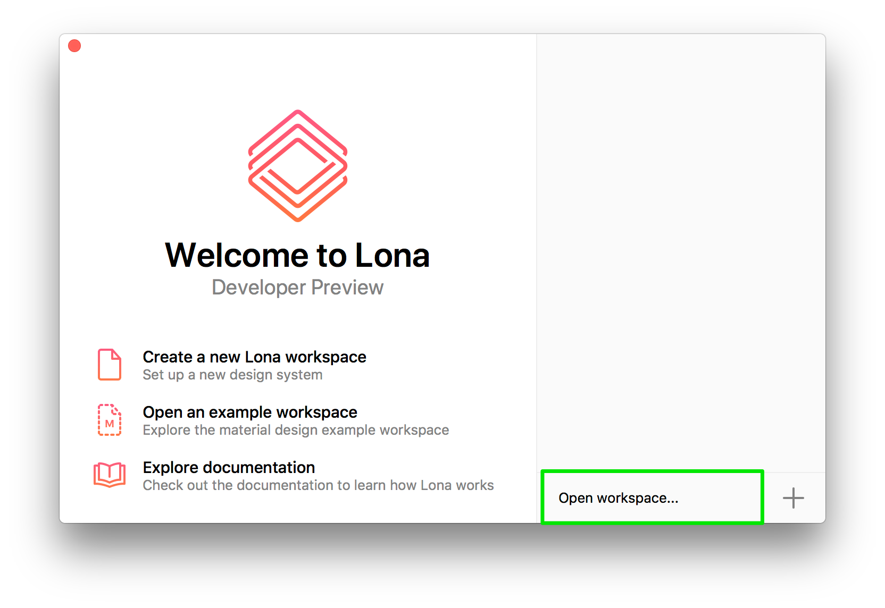

# Lona Studio

Lona Studio provides a graphical interface for working with `.component` files.

> Lona Studio is still _very unstable_, so save frequently and make sure your workspace is backed up via git!

## Installation

The easiest way to use Lona Studio is by downloading the prebuilt Mac App binary... but we're not distributing this until Lona Studio becomes more stable. For now, you'll have to build from source!

## Building from Source

First, make sure you have [`bundler`](http://bundler.io/) and [Cocoapods](https://cocoapods.org/) installed. Then checkout the repo and run:

```bash
cd studio
bundle && bundle exec pod install
carthage bootstrap --new-resolver --platform macOS
```

Open LonaStudio.xcworkspace and build in Xcode 10+ on High Sierra+. If there are warnings (e.g. about project settings) you can ignore them.

### Sketch export (optional)

To enable Sketch export (beta), you'll also need to install [nvm](https://github.com/creationix/nvm/#installation), and run the following (assuming you're in the `studio` directory):

```bash
cd LonaStudio/Scripting/Modules/component-to-sketch
nvm install 8.4
npm install
```

## Workspace

To work in Lona Studio, you'll need a properly configured _workspace_. A workspace is a directory containing, optionally, the following files:

- `colors.json`
- `textStyles.json`
- `gradients.json`
- `shadows.json`
- `types.json`

Opening the material design directory in the `examples` directory of the repo is a good place to start.

You can read more about these in the [file formats docs](../docs/file-formats/README.md). Without these, Lona Studio will not display any colors or text styles in the pickers.

### Creating a Workspace

You can create a new workspace from the launch screen:


After clicking this button, type the name of a new directory. This will create a directory containing several of the JSON files described above.

### Opening a Workspace

To open an existing workspace:



### Changing Workspaces

To change your workspace directory, first open Lona Studio preferences:


Then choose a directory path:


Don't modify the colors or text styles paths unless you really know what you're doing. They're kind of buggy.

If something doesn't work... try quitting and launching Lona Studio again 😢
